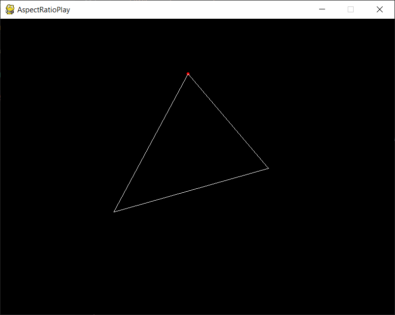

# AspectRatioPlay
Playing with the vertices to see how the triangle's aspect ratio changes.

# What is this?



I wanted something which could show me how triangles of different aspect ratio looks like. <br>
This code helps me play around with the vertices of a triangle and prints out the aspect ratio in the terminal.


# How to run
I have used pipenv to manage dependencies so make sure to install that.

```
$ pip install pipenv
```

Once you have `pipenv`...

```
$ pipenv shell
$ pipenv update
```

Finally,

```
$ python AspectRatio.py
```

To exit from `pipenv` shell simply enter...

```
$ exit
```